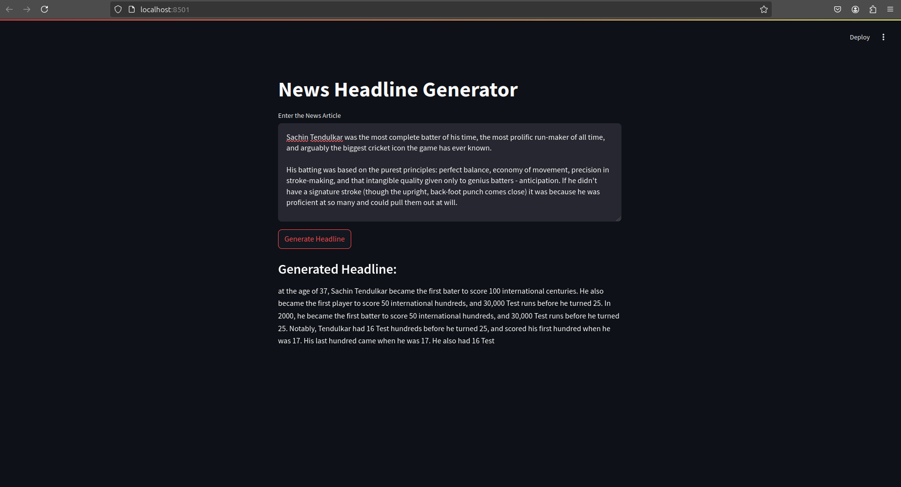
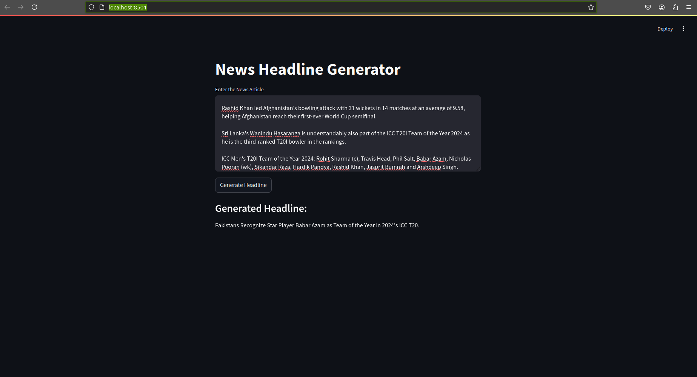

# Structurized Raw Text

Given the detail of unstructured and generate structured text by adding heading/sub-heading/bullet-points etc where necessary require to enhance structured the input text using DeepSeek-R1-Distill-Qwen-1.5B (using ollama) pretrained Language model. Goal is structurized input text without altering the input text.

## High level pipeline    
raw input text -->  |HTML Converter| --> HTML output -->  |HTML to PDF| --> PDF
                    
## Demo



## Setup
create conda virtual environment
```
conda create -n env_name python=3.11.11 -y
```
install requirements
```
pip install -r requirements.txt
```
Install ollama and pull modellocakky

To install ollama refer [here](https://ollama.com/download) according to your system OS.
To pull model use following command
```
ollama run deepseek-r1:1.5b
```

run app
```
streamlit run app.py
```